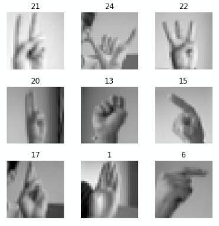
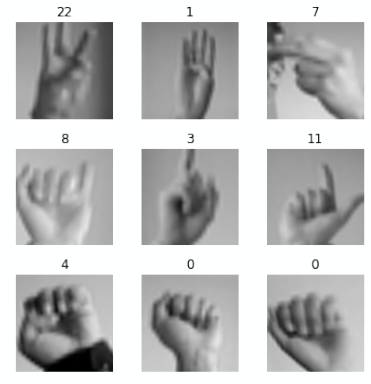

# Classifying the alphabet of the American Sign Language

# Team Members: 
- [Amartya Singh](https://in.linkedin.com/in/amartya-singh-84b6b776)
- [Deepti Jain](https://github.com/djain91)
- [Jay Vora](https://www.linkedin.com/in/jay-vora-50860664/)

#### Our presentation slide can be found [here](https://drive.google.com/file/d/1J4uS84i_BDnjQfh3XwNID9BADqVfDk0B/view?usp=sharing).

# Introduction and Motivation

There are about 70 million deaf people worldwide who speak some dialect of the sign language.

ASL is used by an estimated 0.6 million people in the US making it the most spoken language after English and Spanish.

Over 90 percent of deaf children in the U.S. are born to hearing parents, most of who never learnt the sign language.

Most deaf children worldwide do not receive sign language lessons due to lack of local resources.

Here, we create a classifier that can identify hand gestures from static images and test on live images captured from a user's webcam.

We have also made a small web app [here](https://asl.elder-rabbit.com/fuzzy-octo-guacamole/asm-webcam.html) where users can play around with the classifier outputs.

# Dataset

We use the MNIST style hand gesture recognition dataset from [Kaggle](https://www.kaggle.com/datasets/datamunge/sign-language-mnist)

### Visual representation of the dataset looks as follows:

Original 28 x 28 images

Upscaled 100 x 100 images

Training images are flip transformed and different degrees of colour normalizations are applied. This is done to mitigate the induces bias of left vs right handedness and to prevent the model from learning the skin-tone of the people doing the hand gestures rather than the countours of their fingers.