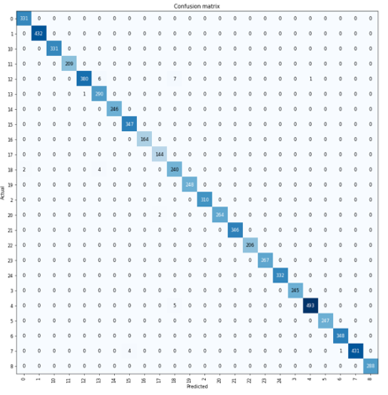
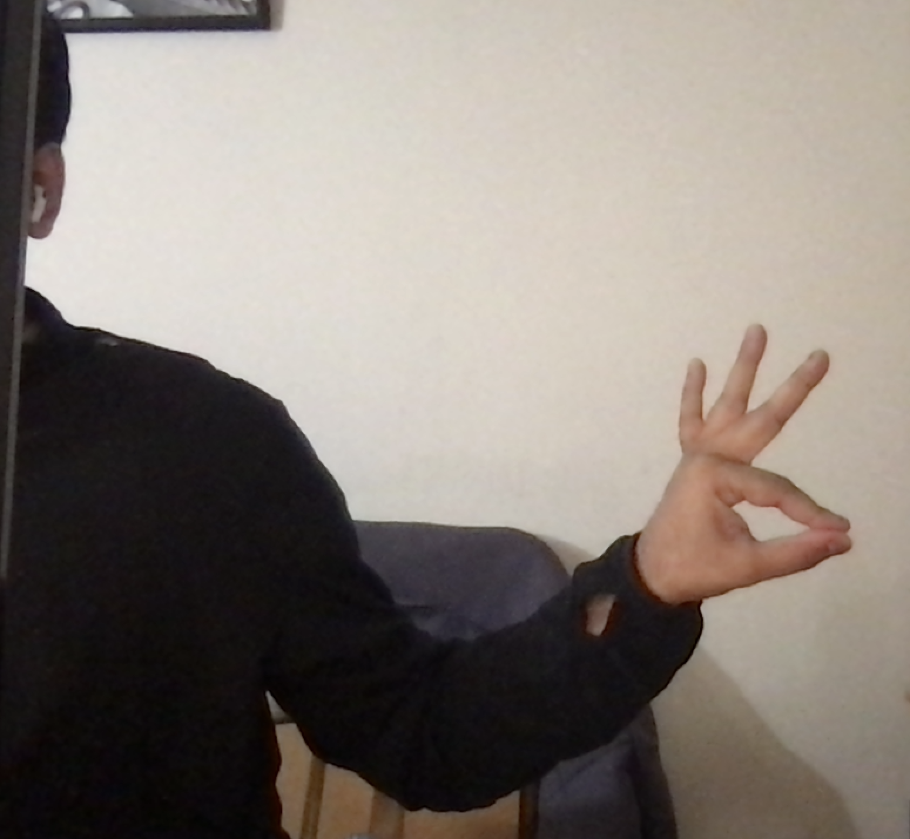
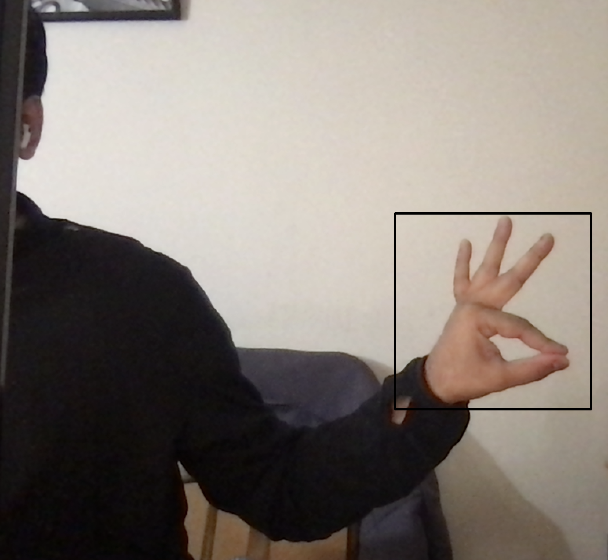
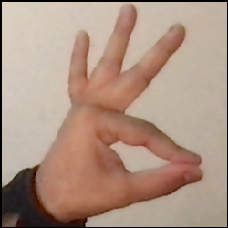
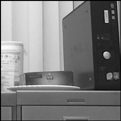
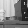

# Classifying the alphabet of the American Sign Language

This project was done as a part of the Erdos Data Science Bootcamp for May 2022

### Team Members: 
- [Amartya Singh](https://in.linkedin.com/in/amartya-singh-84b6b776)
- [Deepti Jain](https://github.com/djain91)
- [Jay Vora](https://www.linkedin.com/in/jay-vora-50860664/)

#### Our presentation slide can be found [here](https://drive.google.com/file/d/1J4uS84i_BDnjQfh3XwNID9BADqVfDk0B/view?usp=sharing).

# Introduction and Motivation

There are about 70 million deaf people worldwide who speak some dialect of the sign language.

ASL is used by an estimated 0.6 million people in the US making it the most spoken language after English and Spanish.

Over 90 percent of deaf children in the U.S. are born to hearing parents, most of who never learnt the sign language.

Most deaf children worldwide do not receive sign language lessons due to lack of local resources.

Here, we create a classifier that can identify hand gestures from static images and test on live images captured from a user's webcam.

We have also made a small web app [here](https://asl.elder-rabbit.com/fuzzy-octo-guacamole/asm-webcam.html) where users can play around with the classifier outputs. Here, we really appreciate the help of [Jannu Sudhakar](https://github.com/JannuSudhakar) specifically with the front-end deployment on Google Cloud Platform.

# Dataset

We use the MNIST style hand gesture recognition dataset from [Kaggle](https://www.kaggle.com/datasets/datamunge/sign-language-mnist)

### Visual representation of the dataset looks as follows:

Original 28 x 28 images

Upscaled 100 x 100 images

Training images are flip transformed and different degrees of colour normalizations are applied. This is done to mitigate the induces bias of left vs right handedness and to prevent the model from learning the skin-tone of the people doing the hand gestures rather than the countours of their fingers.

# Neural Network Training 

We use fastai library which provide an easy access to pre-trained ResNet models. ResNet34 was found to be very accurate also while keeping runtime for predictions low. Runtime is given importance since the eventual goal is model deployment on the cloud.

The training is quick and just 5 epochs are enough to produce a 99% accurate model on the validation data. Using ResNet50 can result in near 100% accuracy but at the expense of prediction runtimes. The validation accuracy and loss for ResNet34 model we foubd are as follows:

We see the following confusion matrix which is indicative of a very good model performance.

### Live Testing

The thing of more interest for us is the performace on live user data. For that, we have an app deployed on the google cloud platform [here](https://asl.elder-rabbit.com/fuzzy-octo-guacamole/asm-webcam.html).

Behind the scene the user webcam image goes through the following steps before begin fed into the model for prediction:

Step 1 - Full Image capture

Step 2 - Make bounding box around user's hand based on used input

Step 3 - Crop the image of the user's hand

Step 4 - Grayscale the image

Step 5 - Resize the image to match training data (however we opted to not downscale user data, instead choosing to upscale training data to get maximum accuracy)

A video of the working of the app can also be found [here](https://drive.google.com/file/d/1VxQsXEzxa5l9pijv89AsOjJpGwRB-GDz/view?usp=sharing)

